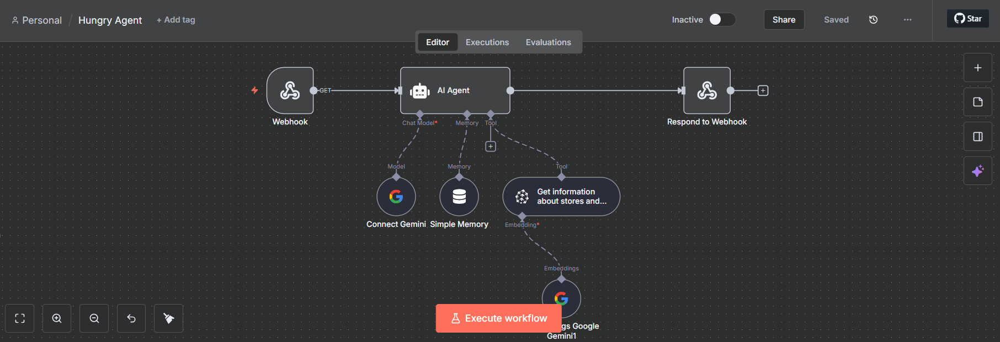
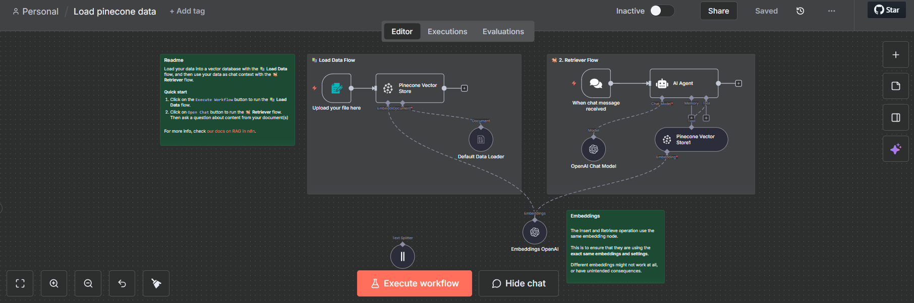

VIBE SHOPPING — by Celeste, Xavi & Joan 🚀

We are Team Adderit.  
Intro: we are building an application that understands human language, observes your face, learns your habits, and speaks a natural-language purchase suggestion back to you — a new way to shop. This demo shows the core of that pipeline: capture (photo + text), synthesize voice, and produce a talking video prototype using VEED (via fal.ai).

---

🔧 Tech & Integrations (overview)
- 1) n8n integration — implemented ❌
- 2) Glovo API integration — implemented ✅
- 3) VEED / FAL API integration — implemented ✅

---

1) n8n integration and Glovo ✅

🧠 System Overview: Glovo Product Intelligence Assistant
1. Introduction

This document describes the workflow, data processing logic, and user interaction procedure of an automated system built using N8N, Gemini, Pinecone, and the Glovo API.
The purpose of the system is to allow users to ask natural language questions (e.g., “Which stores sell vegan food?”) and receive accurate, up-to-date information derived from Glovo’s product and store database.

2. System Components
Component	Description
N8N	The workflow automation platform that orchestrates all tasks — from API calls to data enrichment, embedding generation, and query handling.
Glovo API	Provides raw data about stores, products, and categories available on Glovo.
Gemini (Google)	A large language model used for semantic understanding, question interpretation, and answer generation.
Pinecone	A vector database used to store and search semantic embeddings of products and store descriptions.
3. Workflow Description
Step 1 — Data Retrieval

Trigger: The N8N workflow is initiated manually or on a scheduled basis.

Action: An HTTP Request Node connects to the Glovo API and retrieves structured data about:

Available stores and their metadata (name, category, location, delivery area, etc.)

Product listings (product name, description, tags, and pricing)

Output: A dataset containing structured JSON records for all available products and stores.

Step 2 — Data Preprocessing

N8N processes the raw data using Function Nodes to:

Normalize and clean text fields.

Combine relevant information (e.g., “store + product + category” descriptions).

Filter out irrelevant or duplicate entries.

Step 3 — Semantic Embedding Generation

The processed text entries are sent to Gemini for embedding generation.

Each item (product or store) receives a semantic vector representation that captures its meaning in natural language.

These embeddings enable similarity-based searches later on.

Step 4 — Vector Storage in Pinecone

N8N sends the embeddings and corresponding metadata to Pinecone.

Each record in Pinecone includes:

The embedding vector.

Store or product ID.

Name, description, and category.

Additional metadata such as city, rating, or delivery availability.

Step 5 — User Query Handling

The user submits a natural language question, such as:

“Which stores sell vegan food?”

N8N passes the query to Gemini, which:

Generates a query embedding.

Sends it to Pinecone to perform a vector similarity search.

Retrieves the most semantically relevant records.

Step 6 — Response Generation

The retrieved Pinecone results (e.g., top 5 relevant stores) are sent back to Gemini.

Gemini synthesizes the data into a natural language response, such as:

“You can find vegan food in stores like Green Market, BioVeg, and SuperFresh in your area.”

The final answer is then returned to the user through N8N’s output interface (e.g., chatbot, web app, or email).

4. User Interaction Procedure
Step	Action	System Response
1	User opens the assistant interface (chat, web form, or API endpoint).	The system greets the user and prompts for a query.
2	User asks a natural question (e.g., “Where can I buy organic fruit?”).	The system sends the question to Gemini for embedding and semantic search.
3	Gemini queries Pinecone for relevant results.	Pinecone returns the most semantically similar stores/products.
4	Gemini generates a natural response summarizing the findings.	The response is shown to the user, with possible links or details.
5	(Optional) The user can refine or follow up with another query.	The system keeps conversational context to improve relevance.
5. Data Flow Summary
Glovo API → (HTTP Request) → N8N → (Data Processing)
           ↓
        Gemini → (Embeddings)
           ↓
       Pinecone → (Vector Storage)
           ↑
        User Query → Gemini → Pinecone (Search) → Gemini (Answer) → User

6. Automation and Maintenance

The system can be configured in N8N to update data periodically (e.g., every 12 hours).

When new stores or products are detected, their embeddings are automatically refreshed in Pinecone.

Error handling and logging nodes ensure stability and traceability of API calls.

7. Example Query and Response

User Input:

“What stores in Madrid sell vegan meals?”

System Response (Generated by Gemini):

“You can order vegan meals from stores like Veggie Planet, Green Corner, and BioMarket. They offer plant-based dishes and groceries available for delivery in Madrid.”

8. Benefits

✅ Scalable: New data from Glovo integrates automatically.

🤖 Smart Search: Users can search semantically, not just by keyword.

🌍 Context-Aware: Answers adapt to user queries and context.

⚙️ Automated Pipeline: Fully managed with N8N, minimal manual intervention.

3) VEED / FAL API integration (what’s inside \`LIPCORE\`) 🎬

This folder contains the working prototype that turns image + text into a talking video via fal.ai’s VEED Fabric model.

What is included
- \`app.py\` — Flask backend (core pipeline):
  - Accepts an uploaded face image and input text.
  - Generates TTS audio (gTTS).
  - Exposes image + audio on a public URL (ngrok for local demos).
  - Enqueues a VEED job on fal.ai (fabric-1.0), polls status, downloads the resulting MP4.
  - Implements an ephemeral session cache so repeated identical requests are instant (saves cost/time).
  - Supports both synchronous and asynchronous job flows (background thread + /status endpoint).
- \`requirements.txt\` — Python dependencies (Flask, requests, gTTS; pydub optional).
- \`start.ps1\` — Windows helper script: creates/activates venv, installs deps, tries to detect ngrok public URL, then starts the Flask app.
- \`static/uploads/\` — uploaded images and generated mp3s (served so VEED can fetch them).
- temp/ephemeral cache (inside a temp folder or \`static/cache/\`) — cached mp4 outputs for the session.
- \`README.txt\` — short quick-run instructions.
- \`create_project.ps1\` — (if present) scaffolding script used to generate the project during setup.

Key behaviors & optimizations
- Default render resolution set to \`480p\` to reduce cost and speed up renders.
- Optional audio trimming (~8–10s) to reduce processing time/cost.
- Ephemeral cache: same image+text in the same session returns a cached MP4 instantly (great for demos).
- Asynchronous flow: create job, return job_id, client polls \`/status/<job_id>\`; final video appears automatically when ready.

Important notes
- fal.ai must be able to download your image/audio via public URL. For local demos use ngrok and set \`PUBLIC_URL\` to your ngrok HTTPS URL.
- Each VEED generation consumes fal.ai credits — test with short text and 480p to save credits.
- Do NOT commit \`FAL_KEY\` or other secrets to git. Use environment variables and \`.gitignore\`.

Example payload sent to fal.ai
\`\`\`json
{
  "image_url": "https://<your-ngrok>/static/uploads/<image>.jpg",
  "audio_url": "https://<your-ngrok>/static/uploads/<audio>.mp3",
  "resolution": "480p"
}
\`\`\`

---

▶ Quick demo (short)
1. Start ngrok:  
   \`ngrok http 5000\` → copy the HTTPS forwarding URL (e.g. \`https://abcd1234.ngrok-free.dev\`)  

2. In a new shell, set session PUBLIC_URL:
\`\`\`powershell
$env:PUBLIC_URL = "https://abcd1234.ngrok-free.dev"
\`\`\`

3. Ensure \`FAL_KEY\` is available (environment variable).  
4. Run app (first run will create venv and install deps):
\`\`\`powershell
.\start.ps1
\`\`\`

5. Open the ngrok URL in browser → upload a photo, enter text, press Play.
- Browser can play immediate TTS for instant UX; final VEED-rendered video will appear when ready.  
- Repeat identical requests during the session are fast via cache.

---

💡 Demo tips
- Pre-render a few common suggestions for instant playback.  
- Keep texts short (<8–10s) for faster, cheaper renders.  
- Use browser SpeechSynthesis for live narration during the demo to create perceived real-time responsiveness.

---

⚠️ Costs & Safety
- Monitor fal.ai usage (dashboard). Each job consumes credits.  
- Revoke and rotate keys if accidentally committed. Never publish \`FAL_KEY\`.  
- This prototype is for demo & prototyping; production needs async workers, rate-limits, security & storage policies.

---

✨ Next steps (we can implement)
- Add n8n workflows to chain events and store results.  
- Integrate Vonage to trigger videos via voice/SMS.  
- Add Norrsken connectors for event flows.  
- Integrate with Glovo MCP to produce persona-driven suggestions for delivery/upsell.  
- Improve final voice quality using a paid TTS (ElevenLabs) or server-side advanced TTS (tradeoff: cost vs latency).

---

Built by Team Adderit — Celeste, Xavi & Joan.  
A new way to shop: understand, observe, suggest — naturally.